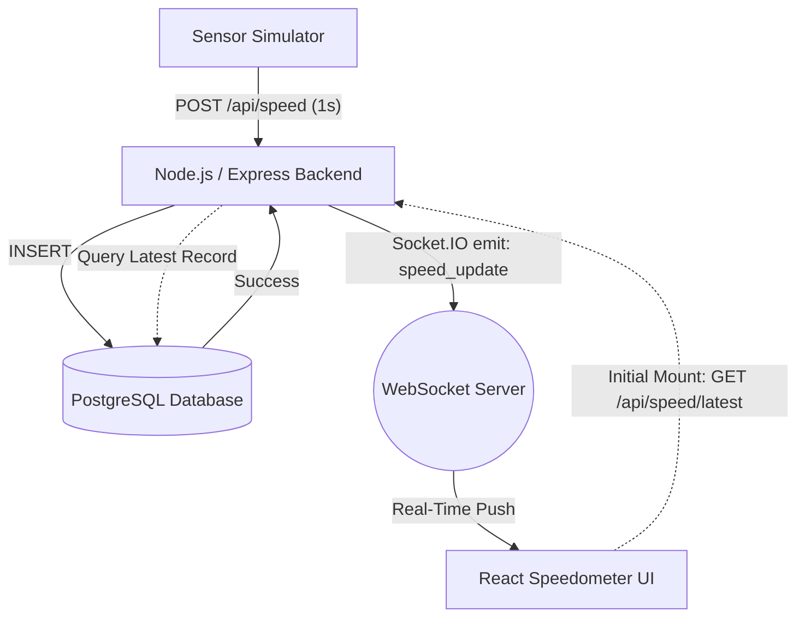

# Unbox Robotics — Real-Time Speedometer

A full-stack real-time speedometer application built for the Unbox Robotics **Robotics Software Engineer — Full Stack** assignment.

---

## Overview

* **Sensor Telemetry:** Speed data is generated and transmitted at 1-second intervals by an autonomous sensor simulator.
* **Database Persistence:** Every speed reading is validated and persisted in a PostgreSQL database with timezone-aware microsecond timestamps.
* **Real-Time UI Updates:** The React frontend receives instant telemetry updates via Socket.IO strictly after database persistence succeeds.
* **Fully Dockerized:** The entire four-tier stack (Database, Backend API, Frontend Console, Sensor Simulator) runs via a single Docker Compose command.

---

## Architecture



Detailed architectural specifications and diagrams are available in [`docs/architecture.md`](docs/architecture.md) and [`docs/submission.md`](docs/submission.md).

---

## Tech Stack

* **Frontend:** React 19, Vite, Tailwind CSS v4, Lucide Icons, Socket.IO Client
* **Backend:** Node.js 18, Express, Socket.IO, `pg` (node-postgres), Jest, Supertest
* **Database:** PostgreSQL 15 Alpine with indexed time-series schema
* **Simulator:** Node.js with Axios
* **Infrastructure:** Docker & Docker Compose (multi-stage builds, bridge network, named volumes)

---

## Project Structure

```text
unbox-robotics/
├── backend/
│   ├── src/
│   │   ├── db/          # PostgreSQL connection pool
│   │   ├── routes/      # Express REST routes & validation
│   │   └── server.js    # Express & Socket.IO server setup
│   ├── tests/           # Jest / Supertest integration tests
│   ├── Dockerfile
│   └── package.json
├── database/
│   └── init.sql         # Database schema & index definitions
├── docs/
│   ├── architecture.md  # Architecture diagram & network topology
│   └── submission.md    # Assignment strategy & challenge analysis
├── frontend/
│   ├── src/
│   │   ├── components/  # Precision SpeedometerGauge component
│   │   ├── App.jsx      # Dashboard layout & Socket.IO consumer
│   │   └── main.jsx
│   ├── Dockerfile
│   └── package.json
├── simulator/
│   ├── index.js         # 1 Hz sensor simulation loop
│   ├── Dockerfile
│   └── package.json
├── tests/
│   └── test_api.sh      # Bash API integration test suite
├── docker-compose.yml   # Multi-container orchestration
├── .env.example         # Default environment template
├── .gitignore           # Git ignore rules
└── README.md
```

---

## Run Locally

### 1. Start the Complete Stack
From the project root directory, run:

```bash
docker compose up --build
```

### 2. Access the Application
* **Frontend Speedometer Dashboard:** [http://localhost:5173](http://localhost:5173)
* **Backend API & WebSocket:** [http://localhost:3000](http://localhost:3000)
* **PostgreSQL Database:** `localhost:5432` (`speedometer_db`)

### 3. Stop the Stack
```bash
docker compose down
```

*(Note: PostgreSQL data persists across restarts in the `pgdata` named volume).*

---

## API Documentation

All endpoints are served under `/api` (or `/health` directly):

* `GET /health`: Returns `{ "status": "ok", "db": "connected" }` when the API and PostgreSQL are healthy.
* `POST /api/speed`: Validates and commits a new velocity reading to PostgreSQL, then emits a real-time event.
  ```json
  // Request Body
  {
    "speed": 48.5
  }

  // Response (HTTP 201 Created)
  {
    "id": "1042",
    "speed": 48.5,
    "recordedAt": "2026-09-21T17:00:15.120Z"
  }
  ```
* `GET /api/speed/latest`: Fetches the single most recently persisted velocity reading (used for initial UI hydration).
* `GET /api/speed/history?limit=8`: Fetches the last $N$ persisted velocity readings ordered by time descending.

---

## Real-Time Flow

1. The **Sensor Simulator** generates a bounded velocity reading and dispatches an HTTP POST request to `/api/speed` every second.
2. The **Node.js Backend** validates the payload (numeric, bounded within 0–120 km/h).
3. The reading is inserted into the **PostgreSQL** `speed_data` table.
4. **Strict DB-First Guarantee:** Only after PostgreSQL returns a successful row insertion does the backend broadcast the `speed_update` event via **Socket.IO**.
5. The **React Frontend** receives the event and updates the speedometer needle, digital readout, and recent readings list instantaneously without polling.

---

## Verification

The system has been verified through automated and runtime checks:

* **Docker Stack:** All 4 containers (`unbox_db`, `unbox_backend`, `unbox_frontend`, `unbox_simulator`) run cleanly with healthy status.
* **PostgreSQL Persistence:** Verified that velocity records increment sequentially and persist across container restarts.
* **Real-Time Stream:** Verified sub-millisecond Socket.IO telemetry delivery with zero browser polling.
* **Automated Test Suite:** All 10/10 backend Jest/Supertest tests pass (`npm test` in `backend/`).
* **Visual & Responsive QA:** Verified across desktop (1440×900), tablet (768×1024), and mobile viewports with zero horizontal scrolling and proper column alignment.

---

## Assignment Deliverables

* **Architecture Diagram:** Mermaid diagram included above and in [`docs/architecture.md`](docs/architecture.md).
* **Working Dockerized Application:** Fully reproducible with `docker compose up --build`.
* **Structured Source Code:** Clean, modular codebase with meaningful separation of concerns and inline comments.
* **Submission Document:** Strategy, database design, and challenge analysis documented in [`docs/submission.md`](docs/submission.md).

---

## Notes

* Default ports: Frontend `5173`, Backend `3000`, Database `5432`.
* To run backend unit tests locally without Docker:
  ```bash
  cd backend && npm test
  ```

