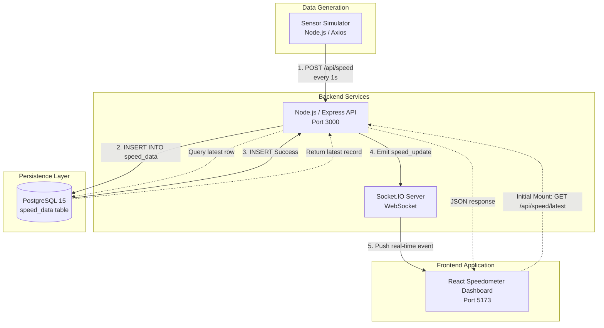

# Architecture Overview — Unbox Robotics Real-Time Speedometer

This document describes the architectural layout and end-to-end data flow of the Unbox Robotics real-time speedometer system.

---

## 1. System Architecture Diagram

---

## 2. Core Principles & Data Flow

### A. Strict Database-First Pipeline
To guarantee data integrity and prevent "ghost telemetry", the backend enforces a DB-first sequence:
1. **Telemetry Ingestion:** The Sensor Simulator transmits a velocity sample to `POST /api/speed` once per second.
2. **Validation:** Express validates that the payload contains a finite, valid numeric speed within physically allowable bounds (0–120 km/h).
3. **Database Insertion:** The velocity record is inserted into the PostgreSQL `speed_data` table with an auto-incrementing ID and microsecond timestamp.
4. **WebSocket Broadcast:** Only after the database `INSERT` operation resolves successfully does the Socket.IO server broadcast the `speed_update` event to connected clients.
5. **UI Rendering:** The React frontend receives the WebSocket packet and updates the speedometer needle, digital readout, and recent readings table in real time without client-side polling.

### B. Initial State Hydration
When an operator loads or refreshes the React dashboard:
1. The frontend issues a `GET /api/speed/latest` REST request to fetch the most recent committed record from PostgreSQL.
2. The frontend issues a `GET /api/speed/history?limit=8` request to populate recent history.
3. The dashboard connects to the Socket.IO server and seamlessly continues receiving real-time live events.

---

## 3. Network & Service Topology

All services are orchestrated with Docker Compose on an isolated bridge network (`unbox_network`):

| Service | Container Name | Technology | Port Mapping | Purpose |
| :--- | :--- | :--- | :--- | :--- |
| **db** | `unbox_db` | PostgreSQL 15 Alpine | `5432:5432` | Relational time-series persistence |
| **backend** | `unbox_backend` | Node.js 18 + Express + Socket.IO | `3000:3000` | REST API, validation & WebSocket server |
| **frontend** | `unbox_frontend` | React + Vite + Tailwind | `5173:5173` | Industrial speedometer monitoring console |
| **simulator** | `unbox_simulator` | Node.js + Axios | Internal | Continuous 1 Hz velocity sensor generator |
